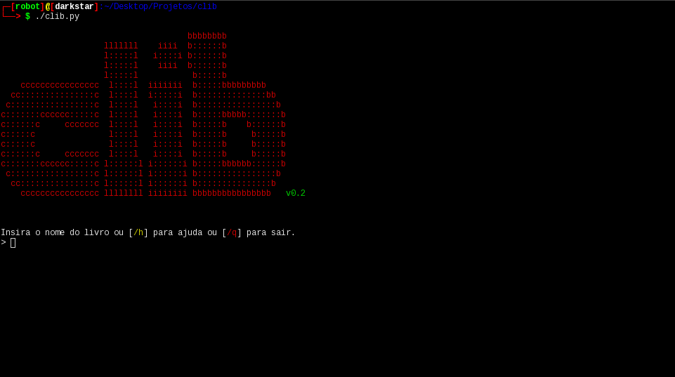
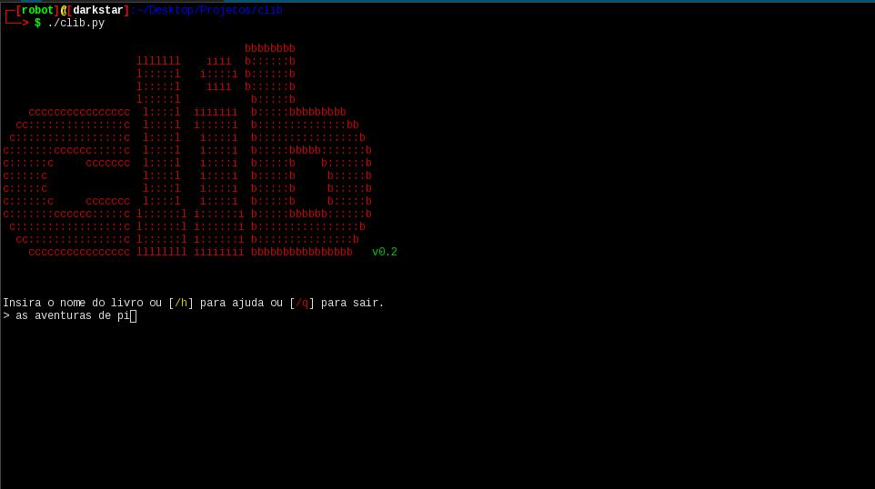
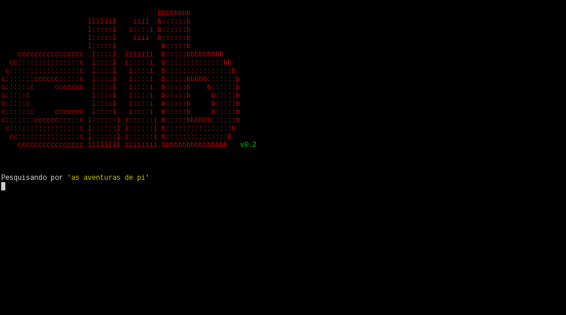
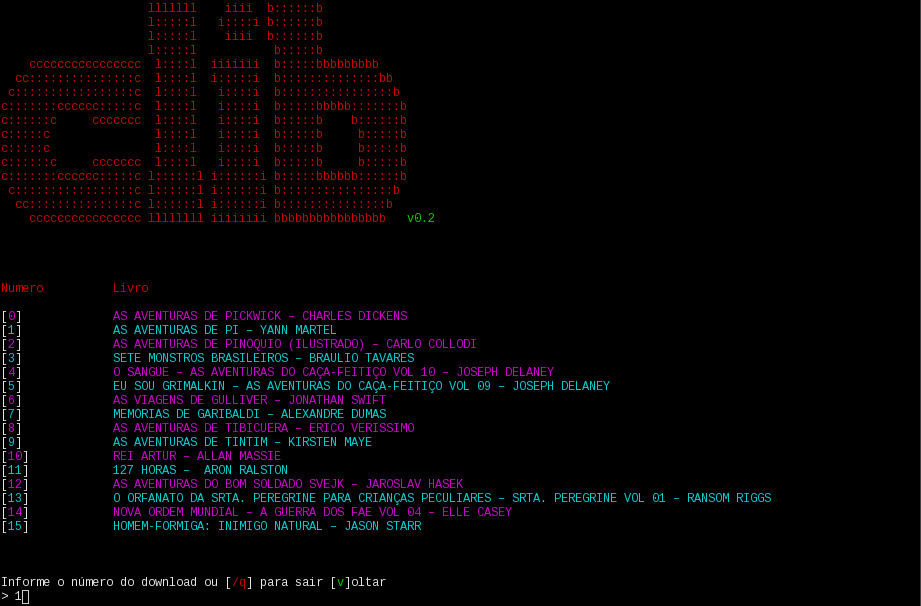
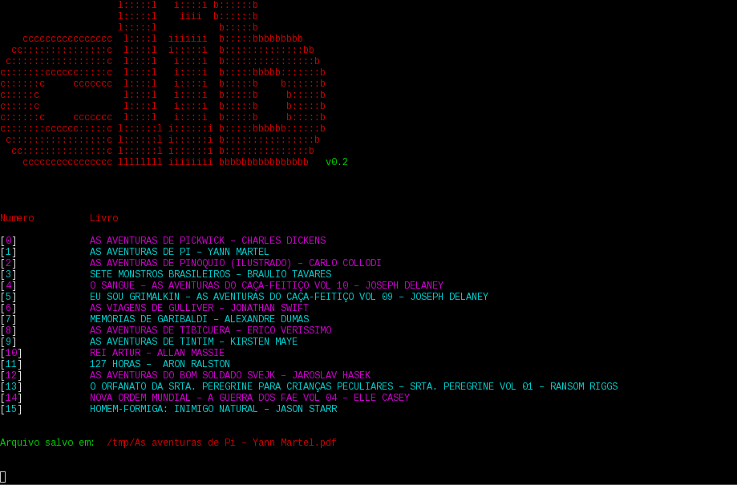

# clib *v0.2* Command line book

### Informação

O projeto não tem nenhum fim lucrativo e é 100% livre.
O único objetivo aqui é contribuir com software livre para a comunidade.

### O que é o clib?

O **clib** é uma ferramenta CLI para a obtenção de livros em formato pdf, utilizando como fonte o site lelivros.com.
Utilizando de vários algoritos de análise de código html, o software faz uma busca pelo livro informado pelo usuário e, se encontrar, faz o download do mesmo.
É livre e está lançado sob a [CC0] (https://directory.fsf.org/wiki/License:CC0).

### Como instalar o clib? 

Dependências:

```
python3.6
pip3.6
git

```
Módulos:

```

beautifulsoup4==4.6.0
bs4==0.0.1
python-utils==2.2.0
six==1.11.0
termcolor==1.1.0
urllib5==5.0.0

```

Instalação:

```
$ git clone https://notabug.org/mrxrobot_/clib.git

$ cd clib

$ su root -c "pip3 install -r requirements.txt" 

```

Se estiver utilizando o Windows, pode apenas usar o conteúdo dentro das aspas duplas, sem o **su root -c**. O **requirements.txt** é um arquivo de texto que contém os modulos do python que serão necessários para o funcionamento do software.


### E agora?

Após ter completado a instalação, pode-se utilizar o clib assim:

```

$ clib

```

### Outras opções

Exibir o menu de ajuda
```
$ clib -h
```

Exibir informações sobre a versão do software
```
$ clib -v
```

**/setd**

Configura o diretório onde serão armazenados os livros no formato pdf.
Se o diretório informado não existir, o programa vai salvar o livro no diretorio em
que estiver sendo executado.
ex:
Se o usuário estiver em /home/ e rodar o programa, os livros serão salvos em /home/

```
/setd /home/diretorio_download/livros
```

# Anonimato ao utilizar o software
O clib pode ser usado juntamente com o tor, assim, garantido uma maior transparência ao realizar a busca e o download dos livros.

## Modo de utilizar o tor com o clib
Uma vez que o serviço do tor esteja rodando na sua máquina, basta usar o **torify**, desse modo, toda a comunicação que for estabelicida entre o clib e a internet passará pelo tor.

```
$ torify ./clib
```

# Outras informações
Além de poder utilizar o tor como um **proxy**, o script foi programado para usar um **user-agent** aleatório para cada (pesquisa/download).
O objetivo de aplicar esta técnica é garantir a privacidade do usuário, uma vez que, não será possivel identicar informações do mesmo.

### Algumas imagens que descrevem o funcionamento do software:

</img><br>
</img><br>
</img><br>
</img><br>
</img><br>
</img><br>


### Como contribuir?

Você pode contribuir de várias maneiras: reportando bugs, aprimorando o código-fonte, fazendo sugestões, etc. 
Forkeie o projeto e mande o seu pull request! 
